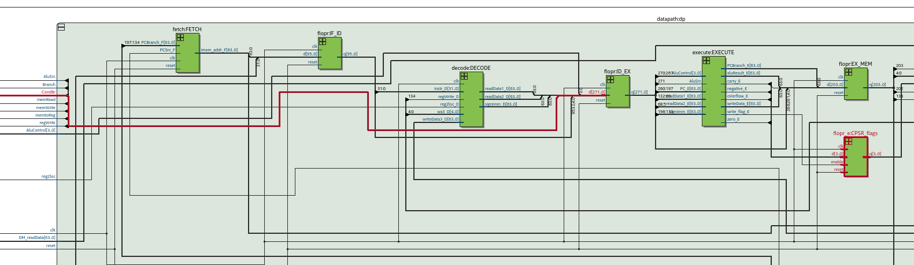
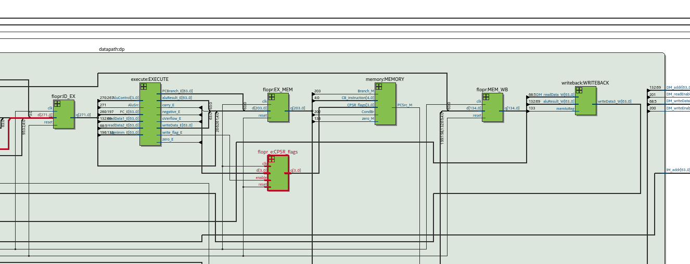
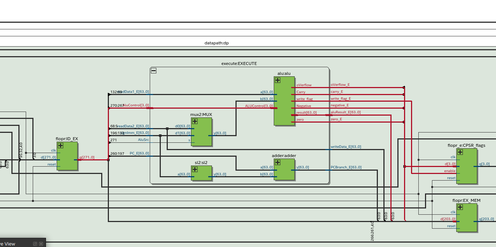
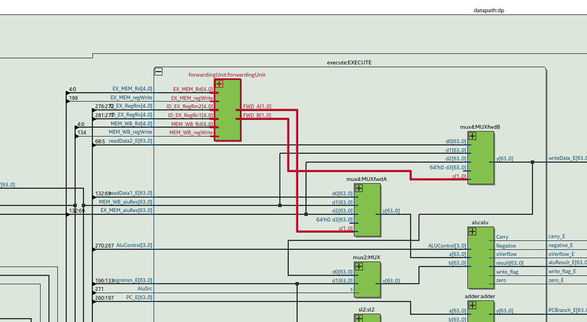
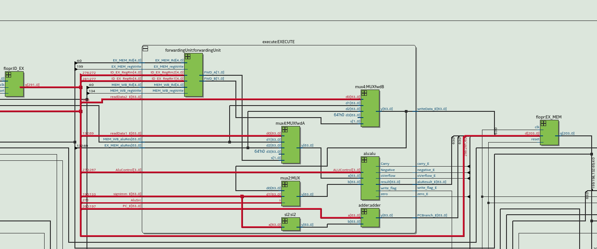
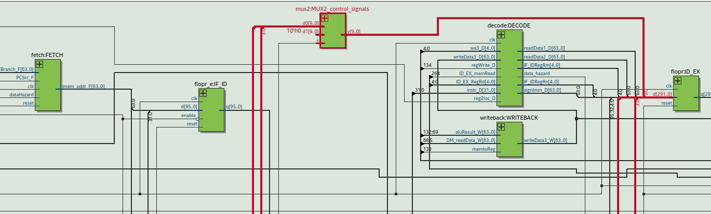
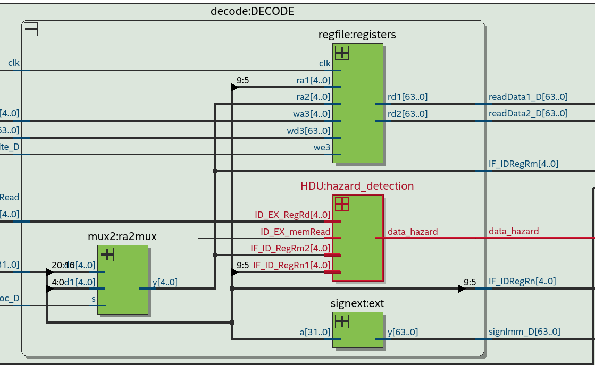
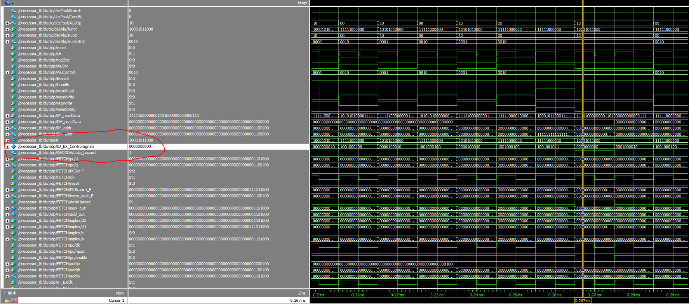
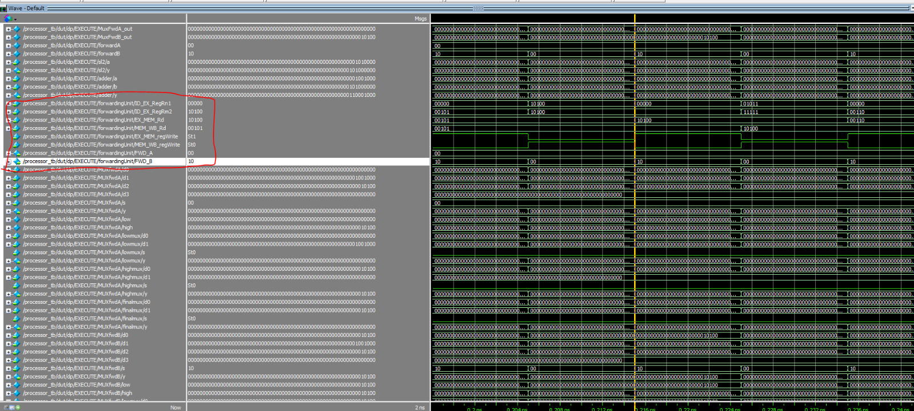

# FaMAF-UNC: Laboratorio 1 Arquitectura de Computadoras 2024

#### Integrantes : Benjamin Ceballos,  Bruno D'Ambrosio, Federico Lucero

Antes de empezar con el ejercicio 1 se modifico el archivo regfile.sv de manera que si uno o más registros leidos
por una instruccion en la etapa #decode están siendo escritos por una instruccion anterior en la etapa #writeback
se obtenga el valor actualizado a la salida de #regfile

## Ejercicio 1

Para implementar las instrucciones ADDI y SUBI, se modificaron los archivos maindec.sv, aludec.sv, y signext.sv:

- En maindec.sv, se especifican las señales necesarias para cada instruccion junto con su ALUOP. En este caso usamos
el ALUOp "11" para distinguir de las demas operaciones.
- En aludec.sv determinamos a partir del ALUOP y el noveno bit si se trata de un ADDI o SUBI, para luego en la ALU
hacer una suma o resta según corresponda.
- En signext.sv solo se rellena con ceros el valor inmediato. En el caso de SUBI no se convierte el numero a negativo
 ya que la ALU ya hace una resta después.

Se deja el siguiente programa para testear la funcionalidad de las nuevas instrucciones ademas de las anteriores:

## Ejercicio 2

Para el ejercicio 2, empezamos agregando las nuevas instrucciones ADDS, SUBS, ADDIS, ,SUBIS, y B.COND con sus respectivos OPcodes y ALUcontrol, modificando maindec.sv, aludec.sv ,alu.sv y signext.sv.

En alu.sv hicimos la logica del seteo de flags y ademas modificamos como haciamos la resta para complementar el operando "b" y sumar "a" y el complemento de "b", en vez de usar el operando de resta, esto se hizo debido a como se comporta la bandera de carry.

Luego de que se calcule todo, de la alu sale ademas del alu_result, el estado de cada flag y la señal de write_flags, la cual indica a CPSR_flags, si debe actualizar cada una de ellas. Este nuevo registro luego se utiliza en el nuevo bloque llamado BcondCheck, utilizado en la etapa MEMORY y dentro del cual se realiza la logica de verificacion de condiciones, este bloque recibe la señal condBr la cual indica si la instruccion en la etapa MEMORY se trata de un salto condicional.
En el caso de que sea, utilizando los ultimos 5 bits, se chequea si la condicion se cumple o no (Dependendiendo del estado de la flags en el registro CPSR_flags). Por último, la señal de output de BcondCheck indica si el salto debe realizarse.

Tuvimos la idea de usar flopr_e para el registro CPSR parecido a lo que se hizo en el lab 3 con los registros de excepcion.

Para verificar el seteo de flags, se modifico el testbench de alu.sv. Además, los programas utilizados para probar el funcionamiento se encuentran en el directorio "PruebaProgramas".(aclaración: el ejercicio1 no tiene todos los programas usados para testear porque no los guardamos, pero la mayoria de los programas en "PruebaProgramas" no funcionarían si addi y subi fallaran)

A continuacion se muestran las partes mas relevantes del diagrama del nuevo procesador, con las señales nuevas y los cambios realizados marcados en rojo.

__Aclaracion__ : (CondBr esta en el bit 265 de ID_EX y 202 de EX_MEM es necesario pasar la señal por esos registros para que no se pierda antes de llegar a bcondcheck cuando venga una instruccion nueva)

## Ejercicio 3

Para el ejercicio 3, primero implementamos la forwarding unit siguiendo los diagramas y codigos mostrados en el libro señalado. Esta se encuentra dentro de execute donde esta comentado y explicado en el codigo la forma en que se detectan los hazard (tratables) y segun si son de execute o mem. A continuacion se muestran algunos diagramas que describen los cambios:

ACLARACION: Hay mas diagramas en la carpeta ImgsInforme sobre las señales de la unidad de forwarding.

Luego, implementamos la unidad de deteccion de Hazard dentro de decode aqui tambien se agregaron cambios para que se mas facil manipular las señales de rn y rm que vienen de ID_EX, nuevamente se siguio al codigo del libro asi como los diagramas, de aqui tambien sacamos la idea del uso del multiplexor para poner en 0 las señales. Tambien se cambia fetch haciendo al PC como un flopr con un enable que se desactive cuando haya data hazard.
Para este Ejercicio esta el Test del programa original en PruebaProgramas donde removemos NOPS.

## CASO STALL:

A continuacion se muestran casos donde las señales se ponen todas en 0 al detectar un hazard:

## CASO FORWARDING:

